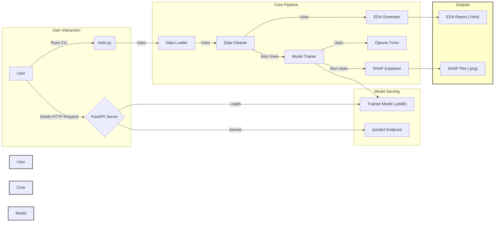

# AutoAI System Architecture

This document provides a high-level overview of the AutoAI system architecture, showing the main components and their interactions.

## Architecture Diagram

```mermaid
graph LR
    subgraph User Interaction
        A[User] -- Runs CLI --> B(main.py);
        A -- Sends HTTP Request --> C{FastAPI Server};
    end

    subgraph Core Pipeline
        B -- Uses --> D[Data Loader];
        D -- Uses --> E[Data Cleaner];
        E -- Uses --> F[EDA Generator];
        E -- Also Uses --> G[Model Trainer];
        G -- Uses --> H[Optuna Tuner];
        G -- Also Uses --> I[SHAP Explainer];
    end

    subgraph Model Serving
        C -- Loads --> J["Trained Model (.joblib)"];
        C -- Serves --> K["/predict Endpoint"];
    end

    subgraph Outputs
        F --> L["EDA Report (.html)"];
        I --> M["SHAP Plot (.png)"];
        G --> J;
    end

    style User Interaction fill:#f9f,stroke:#333,stroke-width:2px
    style Core Pipeline fill:#ccf,stroke:#333,stroke-width:2px
    style Model Serving fill:#cfc,stroke:#333,stroke-width:2px
    style Outputs fill:#ffc,stroke:#333,stroke-width:2px
```
