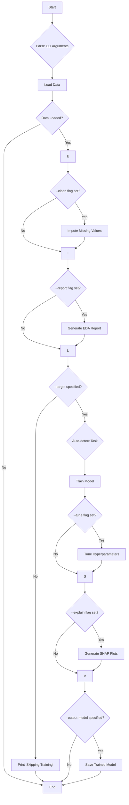

# AutoAI CLI Workflow

This document contains a flowchart that illustrates the operational flow of the `main.py` command-line interface (CLI).

```mermaid
graph TD
    A[Start] --> B{Parse CLI Arguments};
    B --> C[Load Data];
    C --> D{Data Loaded?};
    D -- Yes --> E;
    D -- No --> F[End];

    E --> G{--clean flag set?};
    G -- Yes --> H[Impute Missing Values];
    G -- No --> I;
    H --> I;

    I --> J{--report flag set?};
    J -- Yes --> K[Generate EDA Report];
    J -- No --> L;
    K --> L;

    L --> M{--target specified?};
    M -- Yes --> N{Auto-detect Task};
    M -- No --> O[Print 'Skipping Training'];
    O --> F;

    N --> P[Train Model];
    P --> Q{--tune flag set?};
    Q -- Yes --> R[Tune Hyperparameters];
    Q -- No --> S;
    R --> S;

    S --> T{--explain flag set?};
    T -- Yes --> U[Generate SHAP Plots];
    T -- No --> V;
    U --> V;

    V --> W{--output-model specified?};
    W -- Yes --> X[Save Trained Model];
    W -- No --> F;
    X --> F;

```
